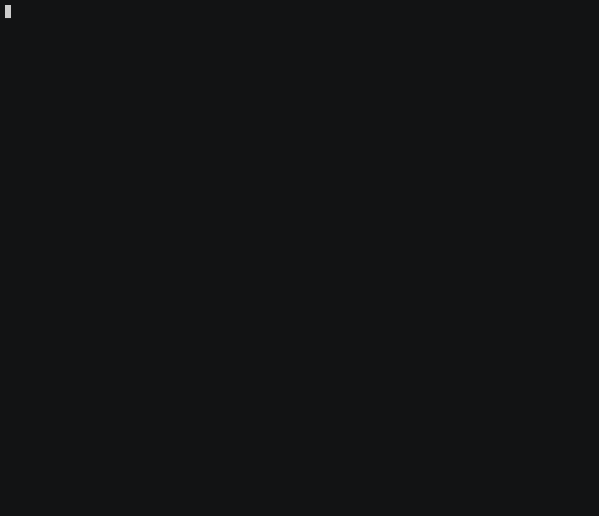

## Overview

`supernova` is a command-line interface (CLI) tool for stress-testing Gno Tendermint 2 networks. It is used to monitor
and report on node performance by executing transactions and measuring response-time.

## Key Features

- 🚀 Batch transactions to make stress testing easier to orchestrate
- 🛠 Multiple stress testing modes: REALM_DEPLOYMENT, PACKAGE_DEPLOYMENT, and REALM_CALL
- 💰 Distributed transaction stress testing through subaccounts
- 💸 Automatic subaccount fund top-up
- 📊 Detailed statistics calculation
- 📈 Output cycle run results to a file

## Results

To view the results of the stress tests, visit the [benchmarks reports for supernova](https://github.com/gnolang/benchmarks/tree/main/reports/supernova).

## Usage Example

To run a stress test with `supernova`, you will need to have `go 1.19` or greater.

1. Build out the binary

To build out the binary, run the following command:

```bash
make build
```

2. Run the stress test by specifying options

```bash
./build/supernova -sub-accounts 5 -transactions 100 -url http://localhost:26657 -mnemonic "source bonus chronic canvas draft south burst lottery vacant surface solve popular case indicate oppose farm nothing bullet exhibit title speed wink action roast" -output result.json
```

This will run a stress test against a Gno TM2 node running at `http://localhost:26657`. The test will use `5`
sub-accounts, and send out `100` transactions. The sub-accounts are derived from the specified mnemonic. Finally,
results are saved
to a file `result.json`.

For any stress test run, there need to be funds on a specific address.
The address that is in charge of funds distribution to subaccounts is the **first address** with index 0 in the
specified mnemonic. Make sure this address has an appropriate amount of funds before running the stress test.



`supernova` supports the following options:

```bash
USAGE
  [flags] [<arg>...]

Starts the stress testing suite against a Gno TM2 cluster

FLAGS
  -batch 20               the batch size of JSON-RPC transactions
  -chain-id dev           the chain ID of the Gno blockchain
  -mnemonic ...           the mnemonic used to generate sub-accounts
  -mode REALM_DEPLOYMENT  the mode for the stress test. Possible modes: [REALM_DEPLOYMENT, PACKAGE_DEPLOYMENT, REALM_CALL]
  -output ...             the output path for the results JSON
  -sub-accounts 10        the number of sub-accounts that will send out transactions
  -transactions 100       the total number of transactions to be emitted
  -url ...                the JSON-RPC URL of the cluster
```

## Modes

### REALM_DEPLOYMENT

The `REALM_DEPLOYMENT` mode is pretty straightforward - it is a simple `Realm` deployment mode from accounts.
This mode sends out transactions that are deploy transactions for a realm holding state.

### PACKAGE_DEPLOYMENT

The `PACKAGE_DEPLOYMENT` is similar to `REALM_DEPLOYMENT`. This mode also sends out transactions, but these transactions
deploy a package.

### REALM_CALL

The `REALM_CALL` mode deploys a `Realm` to the Gno blockchain network being tested before starting the cycle run.
When the cycle run begins, the transactions that are sent out are method calls.
